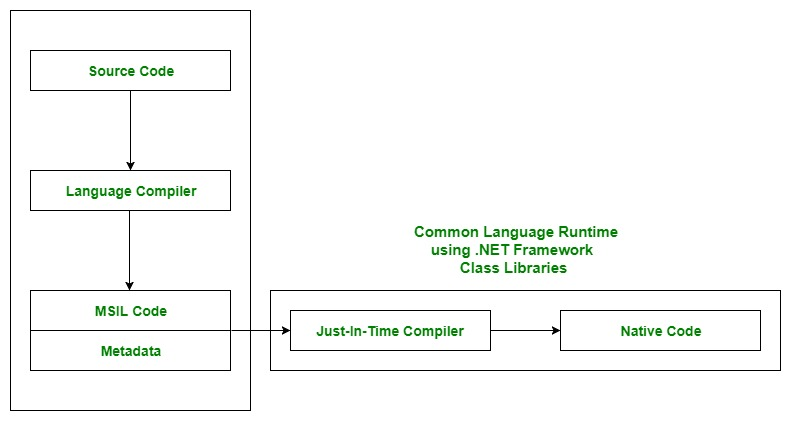

# .NET CLR, CTS, CLS

.NET poskytuje běhové prostředí [Common Language Runtime (CLR)](https://docs.microsoft.com/en-us/dotnet/standard/clr), které je definováno nezávisle na jeho konkrétní implementaci (Mono, .NET Framework nebo .NET Core/.NET 5+). CLR odstiňuje kód od konkrétního hardware nebo použitého jazyka a poskytuje společný rámec pro návrh, překlad a spouštění tzv. managed kódu.

CLR zajištuje
- Definuje společný typový systém (Common Type System), který využívají jazyky využivající .NET.
- Definuje pravidla pro interakci typů mezi jednotlivými jazyky (CLS Common Language Specification)
- Definuje způsob popisu komponent (Metadata). Každá managed komponenta obsahuje informaci o komponentách, ze kterých se skládá a které referencuje.
- Alokuje paměť Stacks (zásobníky), Managed Heap (Halda)
- Automatické uvolňování managed paměti (Garbage Collect)
- Nahrávání IL a jeho převod do nativního kódu (JIT compilace)

# Microsoft Intermediate Langauge (MSIL, též CIL nebo IL)

Mezilehlý jazyk, do kterého jsou kompilovány všechny ostatní jazyky podporující .NET

- je objektově orientovaný (OOP)
- je bytecode - instrukční sada určená pro software nebo stroj - skládá se z [číselných kódů](https://en.wikipedia.org/wiki/List_of_CIL_instructions) operací a jiných
- má binární povahu
- založený na zásobníku (stack-based - založený na přesouvání krátce-platných informací z a do zásobníku) 
- vzniká kompilací ze zdrojového kódu některého z jazyků .NET
- je překládán jednou z implementací CLR do nativného strojového kódu pro běh na konkrétním podporovanéh hardware

# BCL (Base Class Library)

CLR, CLT a ostatní vytváří rámec pro vykonávání managed a unmanaged kódu, ale bez většího množství hotové funkcinality by se jen těžko používali.
Proto existuje BCL (Base Class Library)

Je to sada knihoven, které poskytují funkcionalitu pro jazyky .NET (Namespace System, System.Collection, System.IO, System.Linq apod.)

https://docs.microsoft.com/en-us/dotnet/standard/automatic-memory-management
https://docs.microsoft.com/en-us/dotnet/standard/common-type-system
https://www.c-sharpcorner.com/blogs/what-are-cts-and-cls-in-net